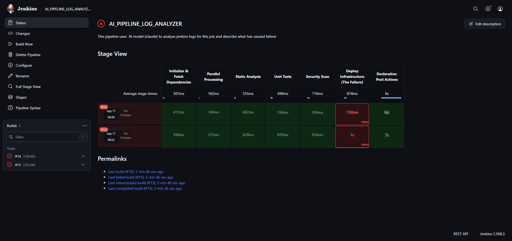
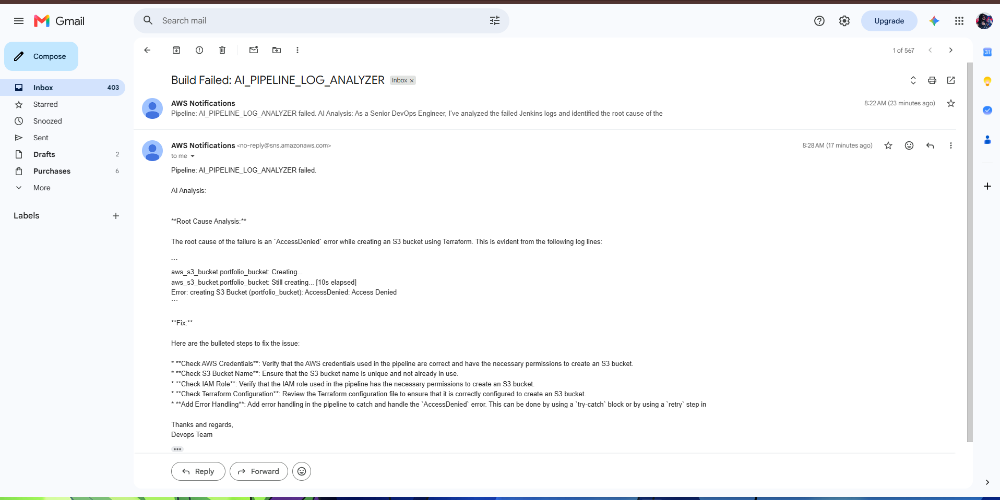

# 🤖 AI-Powered CI/CD Pipeline Log Analyzer

An automated, serverless incident response tool that integrates **Jenkins CI/CD** with **Amazon Bedrock (Meta llama 3 (8b))** via **AWS Lambda** and **API Gateway**. When a pipeline fails, it extracts recent console logs, eliminates noisy diagnostic output, determines the exact root cause, and emails actionable remediation steps to engineering teams in seconds.

---

## 📐 Architecture Overview

flowchart TD
    subgraph CI_CD["CI/CD Layer (Jenkins)"]
        A[Build / Test / Deploy Stage Fails] --> B[Declarative Post Action Triggered]
        B --> C[Fetch Tail 150-200 Lines of Console Logs]
        C --> D[Format JSON Payload & POST to Webhook]
    end

    subgraph AWS_Cloud["Serverless AWS Architecture"]
        D -->|HTTPS POST| E[Amazon API Gateway HTTP API]
        E -->|Proxy Integration| F[AWS Lambda Python 3.10]
        
        subgraph AI_Inference["AI Layer"]
            F -->|Converse API Payload| G[Amazon Bedrock Claude 3 Haiku]
            G -->|Actionable Root Cause & Fix| F
        end

        F -->|Publish Formatted Alert| H[Amazon SNS Topic]
    end

    subgraph Notification["Notification Layer"]
        H -->|Alert Email| I[Engineer / DevOps Team Inbox]
    end

    classDef aws fill:#FF9900,stroke:#232F3E,stroke-width:2px,color:#232F3E;
    classDef jenkins fill:#D33833,stroke:#232F3E,stroke-width:2px,color:#FFFFFF;
    classDef ai fill:#1E88E5,stroke:#0D47A1,stroke-width:2px,color:#FFFFFF;
    class A,B,C,D jenkins;
    class E,F,H aws;
    class G ai;

---

## ✨ Features

- **Serverless & Zero-Maintenance**: Powered completely by AWS Lambda, API Gateway, and Amazon SNS—no idle compute costs ($0/mo baseline).
- **Intelligent Log Filtering**: Uses the modern Amazon Bedrock `Converse` API to cut through build noise (dependency trees, linters, parallel test outputs) and isolate breaking errors.
- **Infrastructure as Code (IaC)**: Fully provisioned and reproducible using Terraform with automated code packaging.
- **Enterprise-Grade Jenkins Integration**: Uses Jenkins REST APIs and `withCredentials` secret masking to bypass restrictive script approvals securely.

---

## 🛠️ Tech Stack

- **CI/CD:** Jenkins Declarative Pipelines, Groovy
- **Cloud Infrastructure:** AWS (API Gateway HTTP API, Lambda, SNS, IAM)
- **AI / LLM:** Amazon Bedrock (Anthropic Claude 3 Haiku)
- **IaC:** Terraform
- **Backend / Scripting:** Python 3.10 (Boto3), Bash, cURL

---

## 🚀 Getting Started

### 1. Prerequisites
- AWS CLI configured with administrator access.
- Terraform `>= 1.5.0` installed.
- Access granted to **Meta llama 3 (8b)** in Amazon Bedrock console.
- A running Jenkins controller.

### 2. Infrastructure Deployment
Clone this repository and deploy via Terraform:

```bash
git clone [https://github.com/](https://github.com/)<your-username>/ai-pipeline-log-analyzer.git
cd ai-pipeline-log-analyzer/terraform

# Initialize and deploy
terraform init
terraform apply -var="email_address=your.email@example.com"
```


**Note:** Check your email inbox to confirm the Amazon SNS subscription link!

**Copy the output URL:** 

jenkins_webhook_url = "https://<api-id>.execute-api.<region>[.amazonaws.com/webhook](https://.amazonaws.com/webhook)"

### 3. Jenkins Setup

1. API Token: Go to User Profile » Security » API Token and generate a new token.

2. Add Credentials:

     Add a Username with password credential with ID jenkins-api-token (Username = your Jenkins login; Password = generated API token).

     Add a Secret text credential with ID WEBHOOK_URL containing your Terraform jenkins_webhook_url.

3. Run Pipeline: Create a pipeline job referencing the provided     Jenkinsfile and trigger a build.

### 📸 Project Screenshots
**Jenkins Pipeline Execution**

The declarative pipeline failing at the deployment stage, triggering the AI webhook post-action.



**AI-Generated Email Alert**

The automated email sent via Amazon SNS containing the AI's root cause analysis and immediate remediation steps.


## 🧪 Sample AI Alert Output

Subject: Build Failed: ecommerce-backend

Pipeline: ecommerce-backend failed.

AI Analysis:
- Root Cause: The build failed during the Terraform execution step because of an AWS S3 AccessDenied error (HTTP status code 403) when attempting to create 'portfolio_bucket'.
- Recommended Fix:
  1. Inspect the IAM role executing the Terraform pipeline to verify it includes the 's3:CreateBucket' permission.
  2. Verify that there is no organization-level SCP or S3 Public Access Block actively preventing new bucket provisioning.

Thanks and regards,
Devops Team

## 🧹 Cleanup
To tear down all deployed cloud infrastructure and avoid any unintended charges:
``` bash
terraform destroy -var="email_address=your.email@example.com"
```